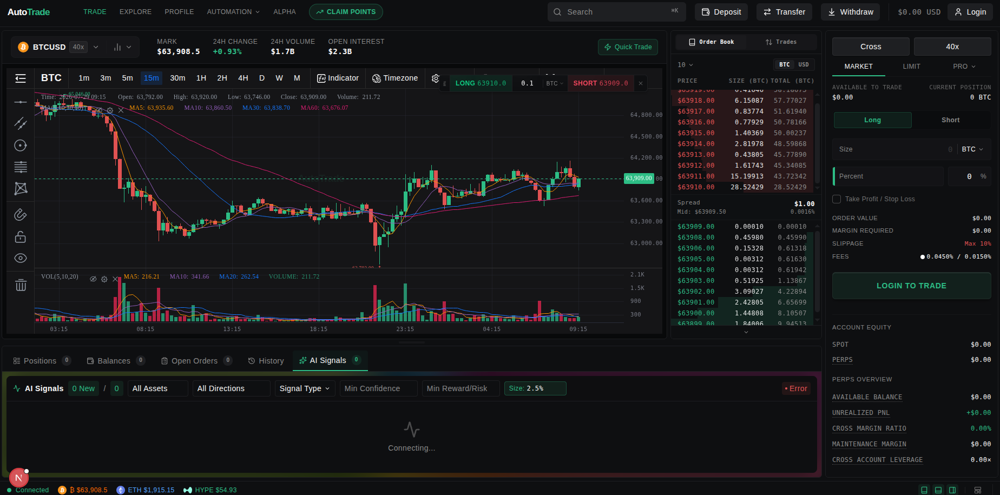
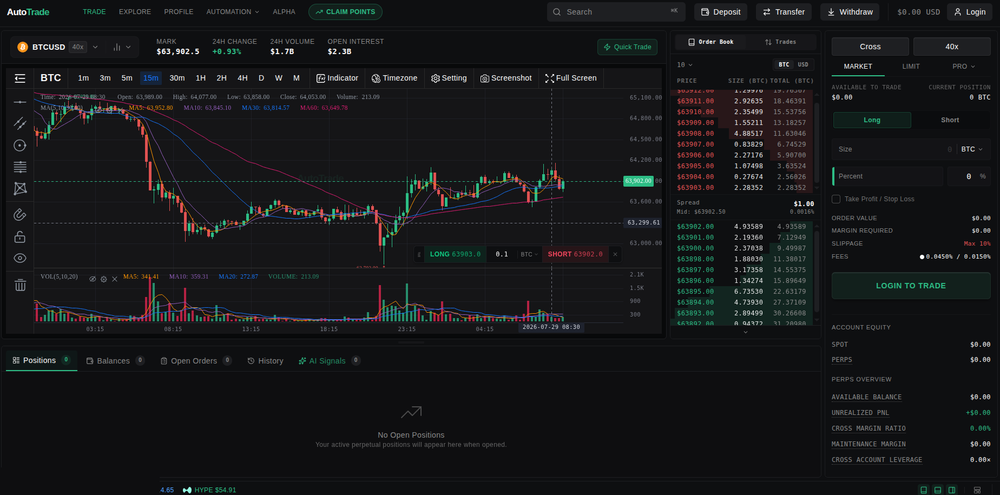
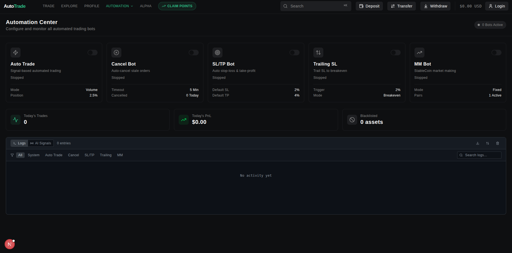
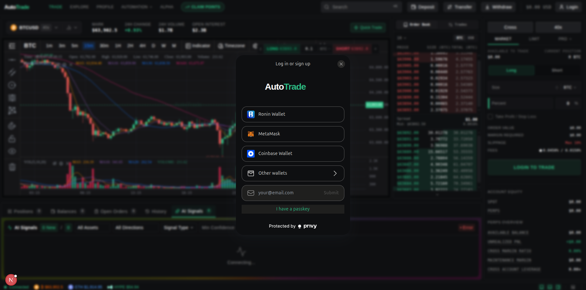

# AutoTrade Trading Terminal

A full browser-based trading workstation built to unify authenticated user accounts, wallet and exchange connectivity, live market and portfolio state, advanced charting, analytical signals, order and position management, risk controls, and automated execution within a configurable professional interface.

## Ownership

I independently architected and built the trading terminal from product requirements through implementation and deployment. Three additional developers contributed to other parts of the broader AutoTrade platform; the terminal itself was my solo product and engineering responsibility.

## Public portfolio snapshot

This repository is a sanitized snapshot of selected components from a larger private production system developed between 2023 and 2026. The original Git history, production credentials, user information, private endpoints, proprietary execution logic, internal infrastructure, restricted integrations, and some newer revisions are intentionally excluded.

The repository is provided to demonstrate the scope of the application, architecture, interface design, integration patterns, and selected implementation work. It is not a complete production deployment and the single public commit does not represent the original development timeline.

## Product scope

The terminal was designed as a unified working environment rather than a chart with an attached order form.

### Authenticated account and wallet experience

- authenticated user sessions and protected application flows
- wallet-aware account identity and connection state
- exchange authorization boundaries
- user-linked application data and preferences
- secure separation between browser-visible configuration and server-side credentials

### Live market, account, and portfolio state

- real-time market and analytical information
- positions, orders, fills, balances, and portfolio context
- shared client state across interconnected panels
- coordinated updates between market views, account views, analytical signals, and execution controls
- recovery from interrupted or stale external data connections

### Professional workspace and visualization

- configurable and resizable workstation panels
- multiple charting engines for different analytical and market views
- dense information architecture designed for rapid decision-making
- responsive interface behavior across available screen sizes
- visual state, notifications, and feedback for asynchronous actions

### Order, position, risk, and automation workflows

- order construction and validation
- position and open-order management
- risk-sensitive controls and execution safeguards
- automated execution workflows connected to structured analytical output
- support for advanced production execution behavior, with proprietary or sensitive implementation details omitted from the public snapshot

### Signal and analysis integration

- structured analytical records from multiple upstream pipelines
- unified real-time delivery through the AutoTrade data platform
- connection between market context, trade logic, dashboards, review, and action
- clear separation between deterministic calculations and AI-assisted synthesis

### Platform and persistence

- Supabase-backed application services and persistence
- shared state management through Zustand
- Hyperliquid API integration
- Ethers and Viem wallet and blockchain tooling
- Cloudflare/OpenNext deployment configuration

## Confirmed technology stack

- TypeScript, more than 99 percent of the public repository
- Next.js 16 and React 19
- Zustand shared state
- Privy authentication
- Supabase
- Hyperliquid TypeScript SDK
- Ethers and Viem
- KLineCharts Pro, KLineCharts, Lightweight Charts, and TradingView widgets
- resizable panel architecture
- Framer Motion
- Tailwind CSS
- Cloudflare, Wrangler, and OpenNext

## Architecture

```text
External Exchanges and Data Providers
                 |
                 v
Deterministic Signal and Analysis Pipelines
                 |
                 v
PostgreSQL, Structured Records, and History
                 |
                 v
Authenticated SSE Aggregation and Delivery
                 |
                 v
AutoTrade Trading Terminal
  | Market and Analysis Workspaces
  | Account, Wallet, and Portfolio State
  | Orders, Positions, Risk, and Automation
```

A fuller explanation is available in [`docs/ARCHITECTURE.md`](docs/ARCHITECTURE.md).

## Development arc

### Version 1

The product owner already used a Zapier-connected trade-signal source. I converted that source into a clearer automated product experience, shaping the interface, workflow, delivery logic, deployment, and user support around the existing input.

### Versions 2 and 3

As the product expanded, core behavior moved into custom services. The platform combined normalized exchange data, deterministic mathematical analysis, market structure, liquidation and cascade analysis, risk logic, validation, structured records, local and cloud AI synthesis, real-time distribution, and automated execution.

The terminal became the primary user-facing workstation for bringing those systems together.

## Screenshots

Sanitized captures from a running instance (no real accounts, balances, wallet addresses, or private data).

### Workspace overview

Configurable multi-panel layout: live chart with indicators, order book, order-entry panel, and the real-time analytical signal feed.



### Orders and positions

Market/limit order entry, leverage and risk fields, order book depth, and the positions/balances/orders workspace.



### Automation and risk

Automation center for the signal, cancel, stop-loss/take-profit, trailing-stop, and market-making workflows, with activity logging.



### Authentication

Wallet and email authentication via Privy.



## Security and omitted material

This public repository must not contain:

- private keys, seed phrases, wallet secrets, or API credentials
- database passwords or production connection strings
- private user or customer information
- real production IP addresses or restricted endpoints
- proprietary strategy logic that cannot be disclosed
- company-owned code that is not authorized for publication
- historical commits containing any of the above

Example environment files contain placeholders only. Real deployments require protected environment variables and server-side secret storage.

## Related public repositories

- `pipelineSSE`: persistence, bounded paginated history, authentication, aggregation, real-time delivery, monitoring, and recovery
- `signalpipeline1`: market-data ingestion, deterministic indicators, signal generation, rate limiting, and delivery
- `signalpipeline2`: liquidation, cascade, market-context, correlation, and risk-analysis pipelines

## What this repository demonstrates

- independent ownership of a large production-oriented digital product
- complex TypeScript and React application architecture
- real-time state and data visualization
- authenticated account and wallet experiences
- high-consequence user workflows
- integration of several external systems into one coherent interface
- financial application UX and risk-sensitive interaction design
- deployment and production support across an emerging external ecosystem
